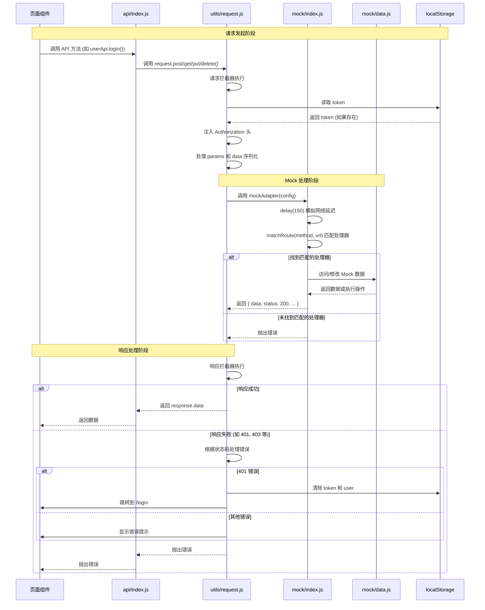

# 项目架构文档

## 1. 概述

本文档详细描述了前端管理系统的数据流和权限控制机制，包括认证状态管理、路由守卫、请求拦截和 Mock 数据模拟等核心模块。

## 2. 认证状态管理 (AuthContext)

### 2.1 初始化流程

AuthContext 使用 React Context API 管理全局认证状态，初始化流程如下：

1. **组件挂载时**：`AuthProvider` 组件挂载后，通过 `useEffect` 触发 `initAuth` 函数
2. **检查本地存储**：从 `localStorage` 读取 `token`
3. **验证 token 有效性**：
   - 如果存在 token，调用 `userApi.getPermission()` 验证 token 有效性
   - 验证成功：更新 `user` 状态，并将用户信息同步到 `localStorage`
   - 验证失败：清除 `localStorage` 中的 `token` 和 `user`
4. **完成初始化**：设置 `loading` 为 `false`

### 2.2 持久化机制

认证状态通过 `localStorage` 进行持久化：

- **token**：存储用户登录凭证，用于 API 请求认证
- **user**：存储用户信息（JSON 序列化），包含权限列表

### 2.3 核心方法

| 方法 | 功能 | 说明 |
|------|------|------|
| `login(credentials)` | 用户登录 | 调用登录 API，存储 token 和 user，更新状态 |
| `logout()` | 用户登出 | 清除 localStorage 中的认证信息，重置状态 |
| `hasPermission(permission)` | 权限检查 | 检查用户是否拥有指定权限（admin 拥有所有权限） |

### 2.4 代码位置

- 主文件：`frontend-admin/src/store/AuthContext.jsx`
- 辅助工具：`frontend-admin/src/utils/auth.js`

## 3. 路由守卫机制 (PermissionRoute)

### 3.1 组件结构

系统提供两种路由守卫组件：

1. **AuthRoute**：基础登录守卫，仅检查用户是否登录
2. **PermissionRoute**：权限守卫，检查用户是否登录且拥有指定权限

### 3.2 守卫逻辑

#### AuthRoute 逻辑流程：

```
1. 检查 loading 状态
   ├── 加载中 → 显示 Spin 加载组件
   └── 加载完成 → 继续
2. 检查用户登录状态
   ├── 未登录 → 重定向到 /login
   └── 已登录 → 渲染子组件
```

#### PermissionRoute 逻辑流程：

```
1. 检查 loading 状态
   ├── 加载中 → 显示 Spin 加载组件
   └── 加载完成 → 继续
2. 检查用户登录状态
   ├── 未登录 → 重定向到 /login
   └── 已登录 → 继续
3. 检查用户权限
   ├── 无权限 → 重定向到 /403
   └── 有权限 → 渲染子组件
```

### 3.3 与 Router 的配合

在 `router/index.jsx` 中，路由守卫通过包裹页面组件实现权限控制：

```jsx
// 需要特定权限的路由
{
  path: 'article/publish',
  element: (
    <PermissionRoute permission={PERMISSIONS.ARTICLE_PUBLISH}>
      <ArticlePublish />
    </PermissionRoute>
  ),
},

// 仅需登录的路由
{
  path: 'article/edit/:id',
  element: (
    <AuthRoute>
      <ArticlePublish />
    </AuthRoute>
  ),
},
```

### 3.4 权限常量

权限定义在 `utils/auth.js` 中：

```javascript
export const PERMISSIONS = {
  ARTICLE_PUBLISH: 'article:publish',
  ARTICLE_MANAGE: 'article:manage',
  REGISTRATION_VIEW: 'registration:view',
  REGISTRATION_EXPORT: 'registration:export',
  SCORE_MANAGE: 'score:manage',
  ADMIN: 'admin',
};
```

### 3.5 代码位置

- 守卫组件：`frontend-admin/src/components/PermissionRoute.jsx`
- 路由配置：`frontend-admin/src/router/index.jsx`

## 4. 请求拦截与 Token 管理

### 4.1 请求封装结构

系统使用 Axios 进行 HTTP 请求封装，结构如下：

```
api/index.js          # API 接口定义
utils/request.js      # Axios 实例配置与拦截器
```

### 4.2 请求拦截器

请求拦截器在 `utils/request.js` 中实现，主要功能：

1. **Token 注入**：从 `localStorage` 读取 token，添加到请求头 `Authorization: Bearer ${token}`
2. **参数处理**：将 `params` 对象转换为 URL 查询字符串（Mock 适配器需要）
3. **数据序列化**：将请求体数据序列化为 JSON 字符串

### 4.3 响应拦截器

响应拦截器处理各种错误情况：

| 状态码 | 处理逻辑 |
|--------|----------|
| 200 | 直接返回 `response.data` |
| 401 | 显示"登录已过期"提示，清除 token，跳转到登录页 |
| 403 | 显示"权限不足"提示 |
| 404 | 显示"请求资源不存在"提示 |
| 500 | 显示"服务器错误"提示 |
| 其他 | 显示响应中的错误消息 |

### 4.4 Token 过期处理

当前实现的 token 过期处理流程：

```
1. 发送请求时携带 token
2. 服务端返回 401 状态码
3. 响应拦截器捕获 401 错误
4. 清除 localStorage 中的 token 和 user
5. 跳转到登录页面
```

**注意**：当前实现没有 token 刷新机制，token 过期后需要用户重新登录。

### 4.5 API 接口定义

`api/index.js` 统一管理所有 API 接口：

- **userApi**：用户相关（登录、获取权限、登出）
- **articleApi**：文章相关（列表、详情、创建、更新、删除）
- **eventApi**：赛事相关（列表、详情）
- **registrationApi**：报名相关（列表、创建、检查、导出）
- **scoreApi**：成绩相关（查询、列表、创建、更新、导出）

### 4.6 代码位置

- 请求封装：`frontend-admin/src/utils/request.js`
- API 定义：`frontend-admin/src/api/index.js`

## 5. Mock 数据拦截机制

### 5.1 实现方案

系统采用**自定义 Axios 适配器**方案实现 Mock 数据拦截，而非使用 MSW (Mock Service Worker)。

### 5.2 工作原理

1. **适配器替换**：在 `request.js` 中，将 Axios 默认适配器替换为自定义的 `mockAdapter`
   ```javascript
   request.defaults.adapter = mockAdapter;
   ```

2. **请求拦截**：所有通过 `request` 实例发送的请求都会被 `mockAdapter` 拦截

3. **路由匹配**：`matchRoute` 函数根据请求方法和 URL 匹配对应的 Mock 处理器

4. **延迟模拟**：通过 `delay(150)` 模拟网络请求延迟，增强真实感

### 5.3 Mock 处理器结构

`mock/index.js` 中的 `handlers` 对象定义了所有 Mock 接口：

```javascript
const handlers = {
  'POST /user/login': async (data) => { /* 登录逻辑 */ },
  'GET /user/permission': async (_, config) => { /* 获取权限逻辑 */ },
  'GET /articles': async (_, config) => { /* 文章列表逻辑 */ },
  // ... 更多处理器
};
```

### 5.4 路由匹配规则

1. **精确匹配**：如 `GET /events` 精确匹配
2. **参数匹配**：如 `GET /articles/:id` 通过正则表达式匹配带参数的路由

### 5.5 Mock 数据来源

Mock 数据定义在 `mock/data.js` 中，包含：

- **users**：用户数据（包含权限信息）
- **events**：赛事数据
- **articles**：文章数据
- **registrations**：报名数据
- **scores**：成绩数据

### 5.6 与真实后端切换

当前实现强制使用 Mock 适配器。如需切换到真实后端，需要：

1. 移除或注释掉 `request.defaults.adapter = mockAdapter;`
2. 配置正确的 `baseURL` 指向真实后端
3. 可能需要调整请求/响应拦截器以适配真实后端的 API 格式

### 5.7 代码位置

- Mock 适配器：`frontend-admin/src/mock/index.js`
- Mock 数据：`frontend-admin/src/mock/data.js`

## 6. 完整请求链路图

### 6.1 组件发起请求到 Mock 响应的完整流程



### 6.2 认证状态初始化流程

```mermaid
flowchart TD
    A[应用启动] --> B[AuthProvider 挂载]
    B --> C[useEffect 触发 initAuth]
    C --> D[从 localStorage 读取 token]
    D --> E{token 存在?}
    E -->|否| F[设置 loading = false]
    E -->|是| G[调用 userApi.getPermission()]
    G --> H{验证成功?}
    H -->|否| I[清除 localStorage 中的 token 和 user]
    I --> F
    H -->|是| J[更新 user 状态]
    J --> K[同步 user 到 localStorage]
    K --> F
    F --> L[认证状态初始化完成]
```

### 6.3 路由守卫执行流程

```mermaid
flowchart TD
    A[用户访问路由] --> B[PermissionRoute/AuthRoute 渲染]
    B --> C{loading 为 true?}
    C -->|是| D[显示 Spin 加载组件]
    C -->|否| E{user 存在?}
    E -->|否| F[重定向到 /login]
    E -->|是| G{是 PermissionRoute?}
    G -->|否| H[渲染子组件]
    G -->|是| I{hasPermission(permission)?}
    I -->|否| J[重定向到 /403]
    I -->|是| H
```

## 7. 关键文件索引

| 文件路径 | 功能描述 |
|----------|----------|
| `frontend-admin/src/store/AuthContext.jsx` | 认证状态管理 Context |
| `frontend-admin/src/components/PermissionRoute.jsx` | 路由守卫组件 |
| `frontend-admin/src/router/index.jsx` | 路由配置 |
| `frontend-admin/src/api/index.js` | API 接口定义 |
| `frontend-admin/src/utils/request.js` | Axios 请求封装与拦截器 |
| `frontend-admin/src/utils/auth.js` | 权限工具函数与常量 |
| `frontend-admin/src/mock/index.js` | Mock 适配器实现 |
| `frontend-admin/src/mock/data.js` | Mock 数据定义 |

## 8. 技术栈总结

- **前端框架**：React 18
- **路由管理**：React Router v6
- **状态管理**：React Context API
- **HTTP 客户端**：Axios
- **UI 组件库**：Ant Design
- **Mock 方案**：自定义 Axios 适配器
- **构建工具**：Vite

## 9. 待优化点

1. **Token 刷新机制**：当前实现没有 token 刷新功能，token 过期后需要用户重新登录
2. **Mock 与真实后端切换**：当前强制使用 Mock，建议添加环境变量控制
3. **错误处理增强**：可以添加更细粒度的错误处理和重试机制
4. **权限缓存**：用户权限可以考虑添加缓存，减少重复请求
